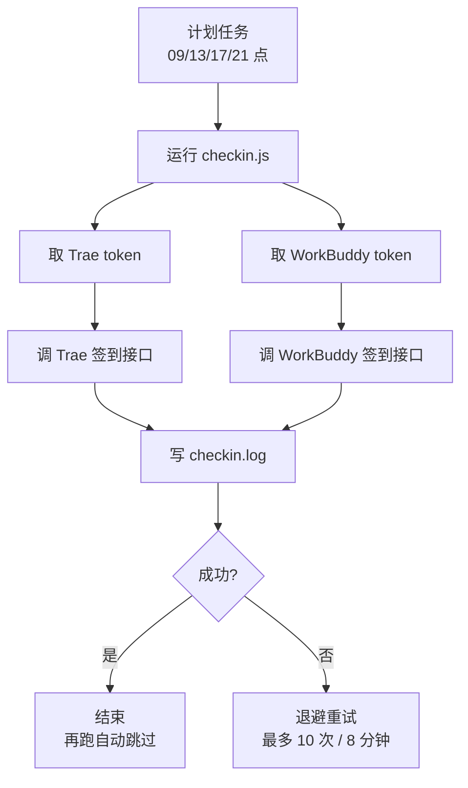

# auto-checkin   

> 一句话定位：它把你每天要手动点的 **Trae CN + WorkBuddy** 签到，变成开机后自动跑完的 Windows 计划任务——给天天用这两个工具、又总忘记签到的人用。


| 项 | 改造前 | 改造后 |
| --- | --- | --- |
| 签到动作 | 打开客户端 → 找到签到入口 → 点一下，两个平台各来一遍 | 什么都不用做，脚本替你点 |
| 触发方式 | 全靠你记得 | Windows 计划任务：每天 09:00 / 13:00 / 17:00 / 21:00 |
| 忘记的后果 | 当天签到作废，第二天清零重来 | 4 个时间点覆盖主要开机时段，错过还会补跑 |
| 登录态 | 客户端得一直保持登录 | 脚本自动从本机客户端登录态取 token，客户端会自行续期 |
| 重复领取 | 手点可能点重 | 幂等：当天成功后其余次数直接跳过 |
| 运行依赖 | — | 签到逻辑零 npm 依赖，只用 Node 内置 `crypto` / `fetch` |
| 可观测 | 签没签上全凭印象 | `checkin.log` 记录脱敏片段 + 积分结果 |

## 适合谁 / 不适合谁

- 适合：如果你要在 **Windows 10 / 11** 上每天领 **Trae CN** 与 **WorkBuddy** 的每日积分，希望「设一次就不用管」，不介意它每天跑 4 次以覆盖不同开机时段。
- 不适合：如果你用 **macOS / Linux**（`register-task.ps1` 是 Windows 计划任务脚本，需自行改用 `cron`）；或电脑**经常几天不开机**（那签到本身也就没意义了）；或你用的是 **Trae 国际版 / 其他版本**（默认对接 `api.trae.cn`，需自行改 `host`）——建议改用系统自带的 `cron` + 官方接口脚本自行拼装。
- 本项目**不做**：不做外挂、不修改客户端、不伪造数据、不做批量或多账号、不做除 Windows 以外的平台适配。

## 安装

### 前置条件

| 项目 | 要求 | 说明 |
| --- | --- | --- |
| 操作系统 | Windows 10 / 11 | `register-task.ps1` 依赖 Windows 计划任务 |
| Node.js | **≥ 18** | 签到逻辑用到内置 `fetch`；可直接用 WorkBuddy 自带的托管 Node |
| Trae CN 客户端 | 已安装且**处于登录状态** | 脚本从它的 `storage.json` 解密出 token（**只读**） |
| WorkBuddy 桌面端 | 已安装且**近期登录过** | 可选；缺这一端脚本会自动跳过 |
| PowerShell | 5.1 或更高 | 注册计划任务用 `Register-ScheduledTask`（**不用** `schtasks.exe`） |

### 该选哪种方式

| 方式 | 适用场景 | 代价 |
| --- | --- | --- |
| AI 提示词一键部署 | 只想用，不想看步骤 | 需要一个能读写本机文件、能执行命令的本机 Agent |
| `git clone` + 手动命令 | 想自己控制每一步 / 要改源码、提 PR | 需 Node 环境 + 会敲命令 |
| Download ZIP | 离线环境 / 想锁版本 | 不自动更新，升级要重新下载 |

> 本项目**不是宿主插件**，没有 `link:` 一类的安装机制；要调试源码，clone 下来直接 `node checkin.js` 跑即可。

<details><summary>方式一：AI 一键部署（推荐，完整步骤）</summary>

**前提只有一个**：你用的 AI 能读写本机文件、能执行命令（WorkBuddy 桌面端、Trae CN、Cursor、Claude Code、Codex 等本机 Agent 都行）。纯网页版聊天机器人没有这些能力，只能给你念步骤。

**用法**：把下面**整段**复制发给 AI，然后等它汇报结果即可。它自己会检查环境、下载项目、跑通签到、注册计划任务并验证。

```text
你是负责帮我在 Windows 电脑上部署一个开源项目的 AI 助手。请直接动手把部署做完，不要只给我步骤、不要让我自己敲命令。每一步都必须真实执行并验证；禁止编造执行结果，某步没做就写明"未执行"并说明原因。

【目标】
把 GitHub 项目 xinshang777/auto-checkin 部署到我这台 Windows 电脑上，实现"每天自动完成 Trae CN 与 WorkBuddy 的每日签到"，并注册为登录后自动运行的计划任务。

【第一步：环境体检，逐项确认】
1. 操作系统是否为 Windows 10/11（命令：右键"此电脑"属性，或 PowerShell 里执行 [System.Environment]::OSVersion.Version）。
2. 是否有 Node.js 18 或更高：
   - 优先检查托管 Node 是否存在：%USERPROFILE%\.workbuddy\binaries\node\versions\ 目录下找 node.exe，有就记下完整路径，后续都用它；
   - 没有就检查系统 node：node -v；
   - 两者都没有，帮我安装 Node.js LTS（winget install OpenJS.NodeJS.LTS，或从 https://nodejs.org 下载安装包），装完重新确认。
3. 我是否装了 Trae CN 客户端并处于登录状态（签到靠读取它的本机登录态取 token）。
4. 我是否装了 WorkBuddy 桌面端并近期登录过（可选，没有这一端会自动跳过）。
把以上 4 项的检查结果先告诉我。若 Trae CN 没装或没登录，明确提醒我"请打开 Trae CN 客户端登录一次"，然后继续完成其余步骤，不要因此停下。

【第二步：下载项目】
默认装到 %USERPROFILE%\auto-checkin：
  git clone https://github.com/xinshang777/auto-checkin.git
如果 git 不可用，就下载仓库 ZIP（https://github.com/xinshang777/auto-checkin/archive/refs/heads/main.zip）并解压到同一位置。
提示：如果目标路径含中文或空格，后续所有命令都要用引号把路径包起来。

【第三步：安装依赖 —— 默认跳过】
本项目纯签到部分是零 npm 依赖的。不要执行 npm install，也不要下载 Playwright 浏览器，除非后面确实需要抓 token 而失败。这样能省下几分钟和几百 MB。

【第四步：准备配置】
把 config.example.json 复制一份为 config.json。
两个平台的 token 字段保持留空即可，脚本会自动从本机客户端登录态里取。
安全要求：config.json 里会存 token，不要把它写到任何仓库、日志或聊天记录里，也不要回显它的完整内容。

【第五步：先手动跑一次，确认真的能签到】
用第二步选定的 node.exe 执行 checkin.js（例如：%USERPROFILE%\.workbuddy\binaries\node\versions\ 下的 node.exe checkin.js，或直接用 node checkin.js）。
判定成功：输出里出现下面任意一句即算成功——
  "WorkBuddy 签到成功" 或 "WorkBuddy 今日已签到（幂等）" 或 "Trae 签到成功"
失败时按下面处理，不要直接放弃：
  - 提示"未找到 WorkBuddy token"：让我打开 WorkBuddy 桌面端登录一次，然后重跑。
  - 提示"未找到 Trae token"：让我打开 Trae CN 客户端登录一次，然后重跑。
  - Trae 提示 9074：先重跑一次，本脚本自带退避重试；若一直 9074，检查日志里的 x-device-id 警告。

【第六步：注册计划任务（每天 09:00 / 13:00 / 17:00 / 21:00 自动运行）】
在 PowerShell 里执行项目目录下的注册脚本：
  powershell -ExecutionPolicy Bypass -File .\register-task.ps1
注意两点：
  1. 必须用 PowerShell 的 Register-ScheduledTask 机制完成注册；有些电脑把 schtasks.exe 禁用了，不要调用 schtasks.exe。
  2. 如果报"语法错误"，说明 register-task.ps1 在传输过程中丢了 BOM——请把它按 UTF-8 with BOM 重新保存，再执行一次。

【第七步：手动触发一次，确认任务真能跑起来】
  Start-ScheduledTask -TaskName DailyCheckin
等待 20 到 60 秒，然后读项目目录下 checkin.log 的最后 30 行，确认这次触发留下了成功记录。
再核对任务注册情况：
  Get-ScheduledTask -TaskName DailyCheckin
应看到 4 个每日触发器（09:00 / 13:00 / 17:00 / 21:00），状态为 Ready。

【必须遵守】
- 全程真实执行，把每步的真实命令输出贴出来；不要脑补结果。
- 任何输出里不要打印完整 token（最多显示前 6 位）。
- 不要修改 checkin.js 和 lib/ 目录下的签到逻辑，本次只做部署。
- 不要删除或改动项目目录以外的任何文件。
- 某步失败：先自行排查（重试、看 checkin.log、按上面提示处理），仍失败就停下来，告诉我具体报错、已经试过什么、当前卡在哪一步。

【最后按这个格式汇报】
1. 项目路径：
2. 使用的 Node 路径与版本：
3. 手动运行结果：成功 / 失败，附关键日志行
4. 计划任务：任务名、4 个触发时间、当前状态
5. checkin.log 最近一次运行结果
6. 还需要我做的事（例如"请打开 Trae CN 客户端登录一次"）
7. 后续如何自查：PowerShell 执行 Get-ScheduledTask -TaskName DailyCheckin 看状态，看 checkin.log 看结果
```

> 如果 AI 能直接联网读仓库，你也可以只说一句：**"按 https://github.com/xinshang777/auto-checkin 的 README 里那段 AI 部署提示词，帮我把这个项目部署好。"**

</details>

<details><summary>方式二：git clone + 手动部署（改源码 / 提 PR 走这条）</summary>

```bash
git clone https://github.com/xinshang777/auto-checkin.git
cd auto-checkin
cp config.example.json config.json      # token 字段留空即可
node checkin.js                         # 先手动跑一次，看到"签到成功"再往下
powershell -ExecutionPolicy Bypass -File .\register-task.ps1
```

- 项目目录**可以整体移动**到任意位置，移动后重跑一次注册脚本即可（任务里记录的是绝对路径）。
- 想用 WorkBuddy 自带托管 Node：`"%USERPROFILE%\.workbuddy\binaries\node\versions\22.22.2-3\node.exe" checkin.js`。
- 改签到时间：编辑 `register-task.ps1` 里的 `$triggers` 数组后重跑注册脚本。
- 要改签到逻辑，看 `checkin.js`（主流程）与 `lib/trae.js`、`lib/workbuddy.js`、`lib/token-sources.js`。

</details>

<details><summary>方式三：Download ZIP（离线 / 锁版本）</summary>

1. 打开仓库页面 → **Code → Download ZIP**，解压到任意目录；
2. `cp config.example.json config.json`，token 字段留空；
3. 用 Node ≥ 18 跑 `node checkin.js`，确认输出成功；
4. PowerShell 执行 `powershell -ExecutionPolicy Bypass -File .\register-task.ps1`。

⚠️ 两点注意：ZIP 解压后的 `register-task.ps1` 必须保持 **UTF-8 with BOM**，否则 PowerShell 5.1 按 GBK 解析会报语法错误；此方式不会自动更新，升级要重新下载。

</details>

### 重启说明

| 场景 | 是否需要重启 |
| --- | --- |
| 刚部署完、注册了计划任务 | 不需要重启电脑，任务即刻生效 |
| 改了 `config.json` | 不需要，下次触发即生效 |
| 改了 `checkin.js` / `lib/*` | 不需要 |
| 改了 `register-task.ps1` 的时间数组 | 不需要重启，但要**重跑一次注册脚本** |
| 刚登录 Trae CN / WorkBuddy 客户端 | 不需要，token 每次运行时现取 |
| 电脑注销 / 关机 | 计划任务不会跑；下次开机登录后靠 `StartWhenAvailable` 补跑 |

### 三十秒验证成功

在项目目录打开 PowerShell，执行 `node checkin.js` → 看到 `WorkBuddy 签到成功` 或 `WorkBuddy 今日已签到（幂等）` 或 `Trae 签到成功` = **装好了**。

## 使用教程

1. **确认任务已注册** —— `Get-ScheduledTask -TaskName DailyCheckin`，应看到 4 个每日触发器（09:00 / 13:00 / 17:00 / 21:00），状态 `Ready`。
2. **立即试跑一次** —— `Start-ScheduledTask -TaskName DailyCheckin`，或在「任务计划程序」里找到 `DailyCheckin` 右键 → 运行。
3. **看结果** —— `tail -n 30 checkin.log`，日志只记脱敏片段与积分结果，不写明文 token。
4. **不用管了** —— 之后每天到点自动跑，签到成功即结束，其余次数自动跳过。



**配置项**

配置写在项目目录的 `config.json`（从 `config.example.json` 复制而来）。字段与默认值如下：

| 名称 | 类型 | 默认值 | 是否必填 | 作用 |
| --- | --- | --- | --- | --- |
| `trae.host` | string | `https://api.trae.cn` | 否 | 签到接口域名；换用其他版本时改这里 |
| `trae.storageJson` | string | `""` | 否 | 手动指定客户端 `storage.json` 路径；留空自动探测 |
| `trae.cloudideStorage` | string | `""` | 否 | 手动指定登录态存储路径；留空自动探测 |
| `trae.manualToken` | string | `""` | 否 | 手动兜底 token，一般留空（自动取） |
| `trae.tokenFile` | string | `trae-token.json` | 否 | 抓取到的 token 缓存文件 |
| `trae.maxRetry` | number | `10` | 否 | Trae 限流时的最大重试次数 |
| `trae.minWait` / `trae.maxWait` | number | `15000` / `30000` | 否 | 退避等待区间（毫秒） |
| `trae.deadlineMs` | number | `480000` | 否 | 单次运行的重试总时限（8 分钟） |
| `workbuddy.accessToken` | string | `""` | 否 | 基线兜底 token，一般留空（自动扫本机日志采集） |
| `workbuddy.uid` | string | `""` | 否 | 留空：自动从 JWT 的 `sub` 解析 |
| `workbuddy.domain` | string | `""` | 否 | 留空：默认 `www.workbuddy.cn` |
| `workbuddy.atRestSecretKey` | string | `""` | 否 | 留空：离线解密用的静态主密钥（一般不需要） |
| `logFile` | string | `checkin.log` | 否 | 日志文件路径 |

**上表所有字段都可以不填。** 只要两端客户端处于登录状态，脚本每次都能自己拿到 token。

## 常见问题 / 排障

**1｜Trae 返回 `9074 当前参与用户太多，请稍后再试`**

- **原因**：两种可能。① 真实高峰限流——脚本已内置退避重试（最多 10 次 / 8 分钟），通常自己会好；② **`x-device-id` 用错了**——早期脚本误用 `telemetry.devDeviceId`，而客户端实际用的是 `storage.json` 里键名 `iCubeAuthInfo://icube-dc:<数字ID>` 中的 **aha 设备 ID**。
- **处理**：脚本自 2026-09-29 起已自动提取 aha ID，并在缺失时直接打印警告。若仍持续 9074，先确认 `x-device-id` 是否等于 `storage.json` 中 `iCubeAuthInfo://icube-dc:<id>` 的数字 ID，再重跑。注意 `status` 接口不校验设备 ID、只有 `claim` 校验，所以典型现象是「查询一切正常，领取永远失败」。

**2｜`未找到 Trae token` / `未找到 WorkBuddy token`**

- **原因**：客户端没登录，或本机没有可用的 token 缓存/日志。
- **处理**：打开对应的客户端**登录一次**，然后重跑。仍不行再用[使用教程](#使用教程)的手动兜底：Trae 从浏览器 `Local Storage` 的 `Cloud-IDE-Token` 复制；WorkBuddy 从 `Authorization: Bearer eyJhbGci...` 复制 `Bearer ` 之后的部分，填进 `config.json` 的 `workbuddy.accessToken`。

**3｜`register-task.ps1` 报语法错误**

- **原因**：文件含中文，被以非 BOM 编码保存后，Windows PowerShell 5.1 按 GBK 解析导致乱码报错。
- **处理**：把 `register-task.ps1` 按 **UTF-8 with BOM** 重新保存，再执行一次即可。

<details><summary>完整排障表</summary>

| 现象 | 处理 |
| --- | --- |
| **Trae：`9074`** | 真实限流（已自动退避重试）或 `x-device-id` 与 token 不匹配。脚本已自动取 aha 设备 ID；仍持续则按上面第 1 条排查。 |
| **Trae：`9004`** | token / device-id 不正确 → 确认 Trae CN 客户端处于登录状态，或用 `manualToken` 兜底。 |
| **Trae：`未找到 Trae token`** | 客户端未登录且无缓存 → 打开客户端登录一次，或手动提供 token。 |
| **WorkBuddy：`未找到 WorkBuddy token`** | config 与日志都采不到有效 token → 确保桌面端近期登录过，或运行 `node capture-workbuddy-token.js --login`。 |
| **WorkBuddy：`token 已过期`** | 通常是长期未用桌面端，日志里也是旧 token → 运行 `node capture-workbuddy-token.js --login`，或手动复制 Bearer token。 |
| **计划任务不触发** | 确认「仅在用户登录时运行」且电脑未关机/注销（休眠不会自动唤醒，`WakeToRun` 未开启）；用「运行」手动验证。 |
| **`capture-workbuddy-token.js` 无头抓取失败** | 实测：浏览器 profile 无有效登录态时，无头跑 90 秒仍返回 `no-usable-token`。需先执行一次 `--login` 在可见浏览器里登录。只要平时开着桌面端，日志采集就能持续续期，不必依赖这条兜底。 |
| **Trae 积分没到账但日志显示成功** | 以客户端内实际余额为准；接口返回 `code=0`（或 `10001` 今日已签到，视为成功）即脚本无责。 |

</details>

## 兼容性与已知限制

- **宿主最低版本**：Node.js **≥ 18**（依赖内置 `fetch`）；Windows 10 / 11；PowerShell 5.1 或更高。
- **平台差异**：macOS / Linux 未适配，需自行把计划任务换成 `cron`；Trae 国际版等默认 `host` 不匹配，需自行修改。
- **冲突**：同名计划任务 `DailyCheckin` 会被 `register-task.ps1` **先注销再重建**（不会出现两个任务）；与 Trae / WorkBuddy 客户端本身无冲突；脚本对 `storage.json` 只读，不改动客户端任何文件。

## 升级、卸载与数据

- **配置存放位置**：全部在项目目录内——`config.json`（含 token，⚠️ 勿分享）、`trae-token.json`（token 缓存）、`checkin.log`（运行日志）。仓库的 `.gitignore` 已排除这些文件。
- **升级**：`git pull` 后重跑一次 `register-task.ps1` 即可（任务里的路径不变时其实也不必重跑）。
- **干净卸载**：
  ```powershell
  Unregister-ScheduledTask -TaskName DailyCheckin -Confirm:$false
  ```
  然后删除项目目录即可；脚本不在注册表、系统目录等处留任何残留。
- **回滚**：`git checkout <上一个 tag / commit>` 后重跑注册脚本；配置与日志不受影响。

## 隐私

- **数据是否出本机**：不出。除了发给官方签到接口的必要请求，不上传任何内容到第三方。
- **是否联网**：是，但只连两个域名——`api.trae.cn`（Trae）与 `www.workbuddy.cn`（WorkBuddy）。
- **是否读取账号**：读取**本机客户端的登录态文件**（Trae 的 `storage.json` 只读解密、WorkBuddy 的本地日志扫描），这是它自动拿到 token 的唯一途径；**不修改**这些文件，**不**上传到任何地方。
- **日志**：只记录脱敏片段与积分结果，**不写明文 token**。
- 使用「AI 一键部署」提示词时，请只发给**你信任的本机 Agent**；提示词已要求 AI 不回显完整 token，但部署后建议自己花 10 秒确认 `config.json` 没被提交到仓库（`git status` 应看不到它）。

## 实现原理（贡献者向）

<details><summary>挂钩点 · 数据流 · 接口表 · 目录结构</summary>

**挂钩点（无侵入）**

本项目的「挂钩」不是代码注入，而是**信息采集**，共三处，全部只读：

| 挂钩点 | 读取内容 | 用途 |
| --- | --- | --- |
| Trae `storage.json` 的 `iCubeAuthInfo://icube.cloudide` | AES-128-CBC + SHA-512 派生的加密登录态（"tc" 格式） | 解出 Trae token（约 14 天有效，客户端自动刷新） |
| Trae `storage.json` 的**键名** `iCubeAuthInfo://icube-dc:<id>` | aha 设备 ID | 作为 `x-device-id`，缺失会导致 9074 |
| WorkBuddy 桌面端日志 | 落盘的 JWT（`%USERPROFILE%\.workbuddy\logs`、`%LOCALAPPDATA%\CodeBuddyExtension\Logs`） | 取有效期最长的 token（约 55 天） |

**token 选取策略（两端都是「多来源 + 挑最优」）**

Trae：客户端登录态（≈13.8 天，自动刷新） > `config.trae.manualToken` > `trae-token.json` 缓存。
WorkBuddy：本机客户端日志（取有效期最长） > `config.workbuddy.accessToken` > 浏览器会话抓取（`capture-workbuddy-token.js`，最后手段）。

> 实测对比：客户端登录态 token ≈ **13.8 天**，远长于网页会话 token 的 **~8 小时**——这就是「从客户端读」能撑起无人值守的原因。

**数据流**

```
计划任务 → checkin.js
  ├─ lib/token-sources.js 采集 token（多来源，挑有效期最长）
  ├─ lib/workbuddy.js     → POST /v2/billing/meter/daily-checkin
  └─ lib/trae.js          → claim 接口（配 x-device-id = aha ID）
        ↑ 失败 9074 时退避重试（最多 10 次 / 8 分钟）
  → 写 checkin.log
```

**接口表**

| 用途 | 接口 | 鉴权 |
| --- | --- | --- |
| WorkBuddy 状态查询 | `POST https://www.workbuddy.cn/v2/billing/meter/checkin-activity-status` | `Authorization: Bearer <token>` + `X-User-Id: <uid>` |
| WorkBuddy 执行签到 | `POST https://www.workbuddy.cn/v2/billing/meter/daily-checkin` | 同上 |
| Trae 签到 | `api.trae.cn` claim 接口 | `Authorization: Cloud-IDE-JWT <token>`、`x-device-id`、`X-User-Region`（默认 `CN`）、`x-app-version`、`x-device-type`、`x-device-brand`、`x-os-version`；请求体 `{"req_source": 1}`（**不能发空 body**） |

**幂等判定**：`daily-checkin` 返回 `code=0` 为成功；`code=10001`（今日已签到）**一律视为成功**。注意网关会把 `10001` 包成 **HTTP 400**，所以必须按**响应体的 `code`** 判断，不能看 HTTP 状态码。

**目录结构**

```text
auto-checkin/
├── checkin.js                  # 主程序：依次跑 WorkBuddy、Trae，必要时刷新 token，写日志
├── capture-trae-token.js       # Playwright 抓取 Trae 网页会话 token（兜底）
├── capture-workbuddy-token.js  # Playwright 抓取/刷新 WorkBuddy token（最后手段）
├── config.json                 # 你的配置（含 token，⚠️ 不要分享）
├── config.example.json         # 配置模板
├── lib/
│   ├── trae.js                 # Trae：读客户端登录态 + 解密 + 调签到接口
│   ├── workbuddy.js            # WorkBuddy：多来源取 token + 调官方签到接口
│   └── token-sources.js        # token 采集器：扫描本机日志取最新 JWT
├── register-task.ps1           # 注册 Windows 计划任务
└── checkin.log                 # 运行日志
```

</details>

详见 `docs/architecture.md`

## 贡献与反馈

[CONTRIBUTING.md](CONTRIBUTING.md) · [CHANGELOG.md](CHANGELOG.md) · Issue 模板

改签到接口或计费口径前，请先看 `lib/trae.js`、`lib/workbuddy.js`、`lib/token-sources.js` 里的注释——它们记录了对接官方实现时的实测结论（含两个最容易踩的坑：`x-device-id` 必须用 aha 设备 ID、`10001` 被网关包成 HTTP 400）。

## 许可证

未指定 License —— 仓库当前没有 `LICENSE` 文件，作者保留所有权利；如需使用请自行评估。
