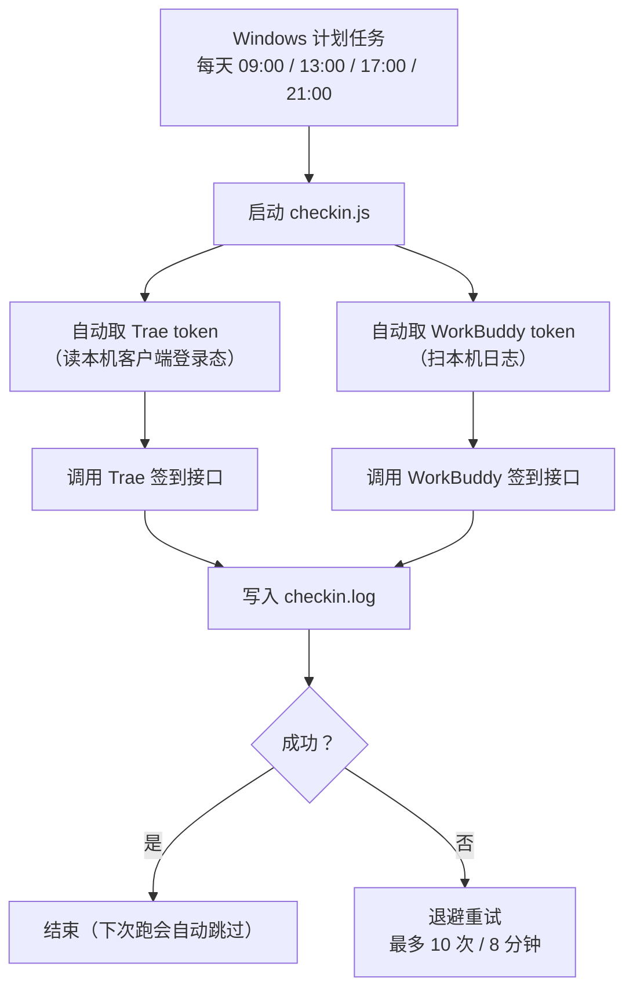

<div align="center">

# auto-checkin

**每天早上自动帮你把两个 AI 工具的每日积分领了。**
支持 **Trae CN** 与 **WorkBuddy**，每天定时跑 4 次，领到就停、不重复领。

[](#三安装与部署)
[](https://nodejs.org)
[](#五实现原理)

</div>

---

## 先花 30 秒搞懂它是什么

| 名词 | 白话解释 |
|---|---|
| **每日签到** | Trae 和 WorkBuddy 都有"每日签到领积分/额度"的活动，**当天不签就作废**，第二天重新开始。 |
| **痛点** | 需要坚持每天手动点一下。出差、周末、忙起来就忘了，白丢积分。 |
| **本脚本** | 一个跑在**你自己 Windows 电脑上**的 Node.js 脚本，自动完成这两个签到。 |

它**不是**外挂、**不**修改客户端、**不**伪造数据——只是把你本来要手动点的那一下自动化了，
用的是官方接口 + 你本机的登录态。

---

## 一、适用范围（谁该用它）

**适合你，如果：**

- 你在用 **Windows 10 / 11**；
- 你同时在用 **Trae CN 客户端**和 **WorkBuddy 桌面端**（用其中一个也可以，另一个会自动跳过）；
- 你**每天都开电脑**（脚本只在开机且已登录时运行）；
- 你希望"设一次就不用管"，不介意它每天跑 4 次以覆盖不同开机时段。

**不适合你，如果：**

- 你用 macOS / Linux——`register-task.ps1` 是 Windows 计划任务脚本，需要自行改用 `cron`；
- 你的电脑**经常几天不开机**（那签到本身也就没意义了）；
- 你用的是 **Trae 国际版**或其他版本——脚本默认对接 `api.trae.cn`，其他版本需自行改 `host`。

> ⚠️ 本项目是**个人本机自动化**，默认仅用于你自己的账号。请遵守平台服务条款，不要用于批量或商业用途。

---

## 二、它能做什么（通俗版）



**四个关键特性：**

| 特性 | 说明 |
|---|---|
| ⏰ **每天 4 次** | `09:00 / 13:00 / 17:00 / 21:00`，覆盖主要开机时段。几点开电脑都能签上。 |
| 🔁 **错过会补** | 计划任务带 `StartWhenAvailable`——错过某次触发，下次开机自动补跑。 |
| ✅ **幂等，不重复领** | 任一次成功即完成，其余次数会识别"今日已签到"直接跳过，不会重复领取。 |
| 🔑 **token 自动获取** | **两端的 token 都能自动拿**，不用你手动抓。详见[第五节](#五实现原理)。 |

---

## 三、安装与部署

### 前置条件

| 项 | 要求 |
|---|---|
| 操作系统 | Windows 10 / 11 |
| Node.js | 18 或更高（脚本会用 WorkBuddy 自带的托管 Node，也可用系统 `node`） |
| Trae CN 客户端 | 已安装且**处于登录状态**（用于自动取 token） |
| WorkBuddy 桌面端 | 已安装且**近期登录过**（用于自动取 token，可选） |

### 第 1 步：下载项目

```bash
git clone https://github.com/xinshang777/auto-checkin.git
cd auto-checkin
```

> 也可以直接点仓库页面的 **Code → Download ZIP** 解压。
> 项目目录**可以整体移动到任意位置**，移动后重跑一次注册计划任务的命令即可。

### 第 2 步：安装依赖

```bash
npm install
```

> 💡 只有在"**需要 Playwright 自动抓 Trae token**"时才用得上依赖。
> 纯签到（`checkin.js` + `lib/*`）**零 npm 依赖**，只用 Node 内置的 `crypto` / `fetch`。
> 想跳过浏览器下载，用：
> ```bash
> PLAYWRIGHT_SKIP_BROWSER_DOWNLOAD=1 npm install
> npm run install-browser    # 需要抓 token 时再执行
> ```

### 第 3 步：写配置

```bash
cp config.example.json config.json
```

然后编辑 `config.json`。**绝大多数人只需要动这里，甚至可以一个字段都不填**：

```jsonc
{
  "trae": {
    "host": "https://api.trae.cn",   // 签到接口域名
    "manualToken": "",               // 一般留空：脚本会自动取
    "tokenFile": "trae-token.json"   // token 缓存文件
  },
  "workbuddy": {
    "accessToken": "",               // 一般留空：脚本会从本机日志自动取
    "uid": ""                        // 一般留空：脚本会从 token 里解析
  },
  "logFile": "checkin.log"
}
```

**为什么可以留空？** 因为脚本会自动从你本机客户端的登录态里取 token：

- **Trae**：从 Trae CN 客户端的 `storage.json` 解密出登录 token（约 14 天有效，客户端会自动刷新）；
- **WorkBuddy**：扫描桌面端日志，挑出**有效期最长**的那个 JWT。

**只要你的客户端是登录状态，脚本每次都能自动拿到新 token——你不需要做任何事。**

### 第 4 步：先手动跑一次（验证配置）

```bash
npm run checkin
```

或者直接用托管 Node：

```bash
"%USERPROFILE%\.workbuddy\binaries\node\versions\22.22.2-3\node.exe" checkin.js
```

看到下面任意一种输出就算成功：

```
WorkBuddy 签到成功
WorkBuddy 今日已签到（幂等）
Trae 签到成功
```

### 第 5 步：注册成计划任务（每天自动跑）

在 **PowerShell** 里运行（脚本会先注销同名旧任务再重建）：

```powershell
powershell -ExecutionPolicy Bypass -File .\register-task.ps1
```

> ⚠️ `register-task.ps1` 含中文，**必须是 UTF-8 with BOM** 编码保存，
> 否则 Windows PowerShell 5.1 会按 GBK 解析并报语法错误。

注册完成后任务名为 **`DailyCheckin`**，包含 4 个每日触发器：`09:00 / 13:00 / 17:00 / 21:00`。

**任务设置**（脚本已内置）：

- 仅在**用户登录后**运行（便于读取本机客户端登录态）
- 允许电池下启动、不因切换到电池而中止
- **错过触发后开机补跑**（`StartWhenAvailable`）
- 仅在**有网络**时运行
- 单次执行时限 15 分钟，失败重启 2 次（间隔 2 分钟）

---

## 四、使用教程

### 查看任务状态

```powershell
Get-ScheduledTask -TaskName DailyCheckin
```

### 立即测试一次

```powershell
Start-ScheduledTask -TaskName DailyCheckin
```

或者直接在"任务计划程序"里找到 `DailyCheckin` 右键 → **运行**。

### 查看运行结果

打开项目目录下的 `checkin.log`：

```bash
# 看最后 30 行
tail -n 30 checkin.log
```

日志只记录**脱敏片段**与积分结果，**不会**写入明文 token。

### 改签到时间

编辑 `register-task.ps1` 里的时间数组，然后重新注册：

```powershell
# register-task.ps1 内部（可自行修改）
$triggers = @('09:00','13:00','17:00','21:00') |
  ForEach-Object { New-ScheduledTaskTrigger -Daily -At $_ }
```

改完重跑第 5 步的命令即可。

### 兜底：手动提供 token（自动获取失败时）

**Trae**——两种方式任选：

- **方式 A：浏览器 F12 复制**
  1. 用 Edge / Chrome 打开 `https://www.trae.cn` 并登录；
  2. `F12` → `Application` → 左侧 `Local Storage` → 找到键 **`Cloud-IDE-Token`**；
  3. 复制其值（`eyJhbGci...` 长串），粘贴到 `config.json` 的 `trae.manualToken`。

- **方式 B：Playwright 自动抓取**
  ```bash
  npm run capture     # 打开浏览器登录一次，会写入 trae-token.json
  ```

**WorkBuddy**——推荐方式：

1. 用 Edge / Chrome 打开 `https://www.workbuddy.cn` 并登录；
2. `F12` → **Network（网络）** → 刷新页面；
3. 随便点一条发往 `www.workbuddy.cn` 的请求，在请求头里找到 `Authorization: Bearer eyJhbGci...`；
4. 复制 `Bearer ` **后面**那整串（不含 `Bearer ` 本身）；
5. 粘贴到 `config.json` 的 `workbuddy.accessToken`。

> 📌 **`uid` 可以留空**：脚本会自动从 token（JWT 的 `sub` 字段）里解析出来。

### 关掉某个平台的签到

如果你不用 Trae 或不用 WorkBuddy，脚本会**自动跳过**拿不到 token 的那一端，无需额外配置。

---

## 五、实现原理

### 1. 整体结构

```text
auto-checkin/
├── checkin.js                  # 主程序：依次跑 WorkBuddy、Trae，必要时刷新 token，写日志
├── capture-trae-token.js       # Playwright 抓取 Trae 网页会话 token（兜底）
├── capture-workbuddy-token.js  # Playwright 抓取/刷新 WorkBuddy token（最后手段）
├── config.json                 # 你的配置（含 token，⚠️ 不要分享）
├── config.example.json         # 配置模板
├── lib/
│   ├── trae.js                 # Trae：读客户端登录态 + 解密 + 调签到接口
│   ├── workbuddy.js            # WorkBuddy：多来源取 token + 调官方签到接口
│   └── token-sources.js        # token 采集器：扫描本机日志取最新 JWT
├── register-task.ps1           # 注册 Windows 计划任务
└── checkin.log                 # 运行日志
```

### 2. token 是怎么"自动拿到"的

这是本项目最核心的部分。**两端都是"多来源 + 挑最优"**：

#### Trae：从客户端登录态解密

Trae 签到接口需要两个头：

```
Authorization: Cloud-IDE-JWT <token>
x-device-id: <deviceId>
```

脚本按 **"有效期最长优先"** 选取 token：

| 优先级 | 来源 | 说明 |
|---|---|---|
| 1 | 本机 Trae CN 客户端的 `storage.json` | 键 `iCubeAuthInfo://icube.cloudide` 是加密登录态，解密后得到 token，**约 14 天有效**，且**客户端会自动刷新** |
| 2 | `config.trae.manualToken` | 手动配置，若有效期更长则优先 |
| 3 | `trae-token.json` | 历史抓取的缓存（兜底） |

**解密算法**：AES-128-CBC + SHA-512 密钥派生（"tc" 格式），已在真实客户端 `storage.json` 上实测验证。

> 实测对比：客户端登录态 token ≈ **13.8 天**有效，远长于网页会话 token 的 **~8 小时**——
> 这就是为什么"从客户端读"能撑起无人值守，而"从网页抓"只适合当兜底。

#### WorkBuddy：扫描本机日志

WorkBuddy 的 accessToken 是 **55 天有效期**的 JWT。脚本按下面的优先级自动挑最新可用的：

| 优先级 | 来源 | 说明 |
|---|---|---|
| 1 | **本机客户端日志** | 桌面端运行时会把它当前有效的 token 写进本地日志，续期后新 token 也会落盘。脚本每次扫描下列目录并取**有效期最长**的一个：<br>`%USERPROFILE%\.workbuddy\logs`（iss=`www.workbuddy.cn`）<br>`%LOCALAPPDATA%\CodeBuddyExtension\Logs`（iss=`www.codebuddy.cn`，同账号可用） |
| 2 | `config.json` 的 `accessToken` | 基线兜底 |
| 3 | **浏览器会话抓取** | 最后手段：`node capture-workbuddy-token.js --login`（登录一次后，之后无头自动刷新）。`checkin.js` 检测到无有效 token 时也会**自动调用**它 |

> 结论：**只要你平时在用 WorkBuddy 桌面端**，脚本就能自动"捡"到它续期后的新 token，基本无需手动干预。

### 3. 调用的接口

**WorkBuddy**（逆向自桌面端 `app.asar`，已可直接调用，**不需要抓包**）：

| 用途 | 接口 | 鉴权 |
|---|---|---|
| 状态查询 | `POST https://www.workbuddy.cn/v2/billing/meter/checkin-activity-status` | `Authorization: Bearer <token>` + `X-User-Id: <uid>` |
| 执行签到 | `POST https://www.workbuddy.cn/v2/billing/meter/daily-checkin` | 同上 |

**幂等判定**：`daily-checkin` 返回 `code=0` 视为成功；返回 `code=10001`（今日已签到）**一律视为成功**。
注意网关会把 `10001` 包成 **HTTP 400**，所以脚本按**响应体的 `code`** 判断，不会误判成失败。

**Trae**：请求头/请求体已按客户端实现完整对齐：

- 请求头：`Authorization: Cloud-IDE-JWT <token>`、`x-device-id`、`X-User-Region`（默认 `CN`）、
  `x-app-version`（取自 `iCubeLastVersion`）、`x-device-type`、`x-device-brand`、`x-os-version`
- 请求体：`{"req_source": 1}`（IDE 客户端为 1，Lite 为 2）——**不能发空 body**

### 4. ⚠️ 最深的坑：`x-device-id` 必须用「aha 设备 ID」

这是**最容易踩、最难查**的一个坑，值得单独讲清楚：

Trae 桌面端（Electron）实际发请求时，用的是 **aha 设备服务注册的设备 ID**，
而**不是** `storage.json` 里的 `telemetry.devDeviceId`。两者是完全不同的值：

| 字段 | 能否用于签到 |
|---|---|
| `telemetry.devDeviceId`（早期脚本误用） | ❌ 返回 `9074` |
| **aha 设备 ID**（客户端实际使用） | ✅ 正常领取 |

aha 设备 ID 就藏在 `storage.json` 的**键名**里：

```
iCubeAuthInfo://icube-dc:<数字ID>
                     ↑ 这一段就是 aha 设备 ID
```

脚本已自动从键名提取（`lib/trae.js` 的 `findAhaDeviceId()`），**无需手工配置**。

**为什么这个坑特别难查**：设备 ID 错误时，服务端返回的是
`9074 当前参与用户太多，请稍后再试`——看起来**完全像高峰限流**，会让人以为"就是抢不到"。
而 `status` 接口**不校验**设备 ID，只有 `claim`（领取）接口校验，
所以现象是**"查询一切正常，领取永远失败"**。

> 自 2026-09-29 起，`lib/trae.js` 在 aha ID 缺失时会**直接打印警告**并说明该 ID 会导致 9074，
> 这一步无需再手工排查。
>
> 若日后再次出现"一直 9074"：**第一件事**是确认 `x-device-id` 是否等于
> `storage.json` 中 `iCubeAuthInfo://icube-dc:<id>` 的数字 ID。

### 5. 重试与退避

Trae 的高峰限流（9074）需要重试窗口：

| 配置项 | 默认 | 说明 |
|---|---|---|
| `maxRetry` | `10` | 最大重试次数 |
| `minWait` / `maxWait` | `15000` / `30000` | 退避等待区间（毫秒） |
| `deadlineMs` | `480000` | 单次运行总时限（8 分钟），到点停止重试 |

计划任务单次时限设为 15 分钟，给 8 分钟的重试窗口留足余量。

> 早期版本把签到排成夜间 `23:00–23:50` 共 6 次，就是为了给 9074 留重试窗口。
> 2026-09-28 修掉 9074 根因后已无必要，精简为现在的 4 次。

---

## 六、排障

| 现象 | 处理 |
|---|---|
| **Trae：`9074`** | **两种成因**：① 真实高峰限流（服务端行为，脚本已自动退避重试）；② **`x-device-id` 与 token 不匹配**——用错了 `telemetry.devDeviceId` 而非 aha 设备 ID。脚本已按客户端实现自动取 aha ID；若仍持续 9074，按[第五节](#4-️最深的坑x-device-id-必须用aha-设备-id)排查。 |
| **Trae：`9004`** | token / device-id 不正确 → 确认 **Trae CN 客户端处于登录状态**（脚本会自动取它维护的 token）；或用 `manualToken` 兜底。 |
| **Trae：`未找到 Trae token`** | 客户端未登录且无缓存 → 打开 Trae CN 客户端登录一次，或按第四节兜底提供 token。 |
| **WorkBuddy：`未找到 WorkBuddy token`** | config 与日志都采集不到有效 token → 确保桌面端近期登录过；或运行 `node capture-workbuddy-token.js --login` 登录一次；或手动粘贴。 |
| **WorkBuddy：`token 已过期`** | 通常是长期未用桌面端，导致日志里也是旧 token → 运行 `node capture-workbuddy-token.js --login`，或手动复制 Bearer token。 |
| **计划任务不触发** | 确认"仅在用户登录时运行"且电脑未关机/注销（休眠不会自动唤醒，`WakeToRun` 未开启）；用"运行"手动验证。4 个触发点已覆盖主要开机时段，错过还会补跑。 |
| **`capture-workbuddy-token.js` 无头抓取失败** | 实测（2026-09-29）：若浏览器 profile 无有效登录态，无头跑 90 秒仍返回 `no-usable-token`。需执行一次 `--login` 在可见浏览器里手动登录，登录态落盘后自动刷新才可用。**只要平时开着桌面端，日志采集就能持续续期，这条兜底不必依赖。** |
| **`register-task.ps1` 报语法错误** | 该文件含中文，必须保存为 **UTF-8 with BOM**；否则 PowerShell 5.1 按 GBK 解析会出错。 |

---

## 七、安全

- `config.json`（含 token）与 `trae-token.json` **不要提交到公开仓库、不要分享给他人**。
  仓库里的 `.gitignore` 已排除这些文件。
- 脚本只**读取** Trae 的登录态文件，**绝不修改**它。
- 日志**不记录明文 token**（仅脱敏片段与积分结果）。
- WorkBuddy 的 token 仅发往 `www.workbuddy.cn` 官方签到接口，**不上传任何第三方**。
- 仅用于**本机本人账号**的合规个人自动化。

---

## License

未指定 License。作者保留所有权利；如需使用请自行评估。
